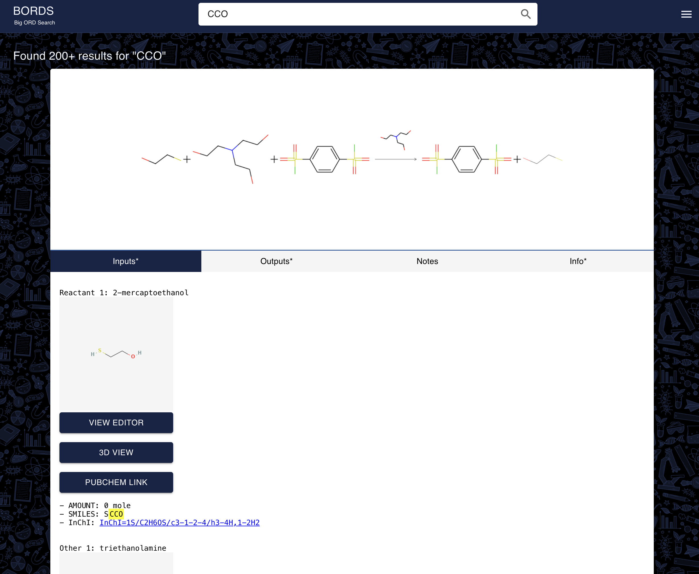
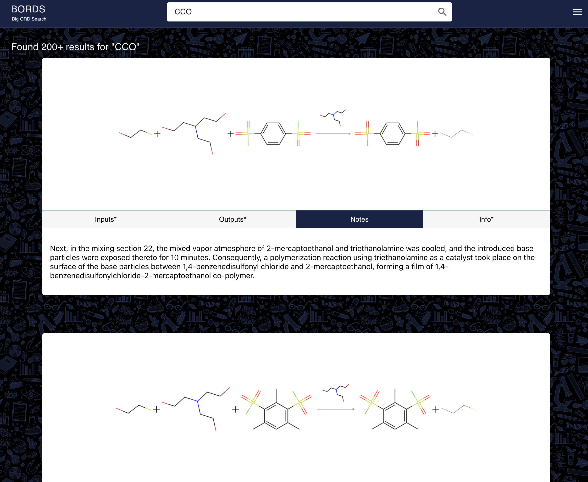
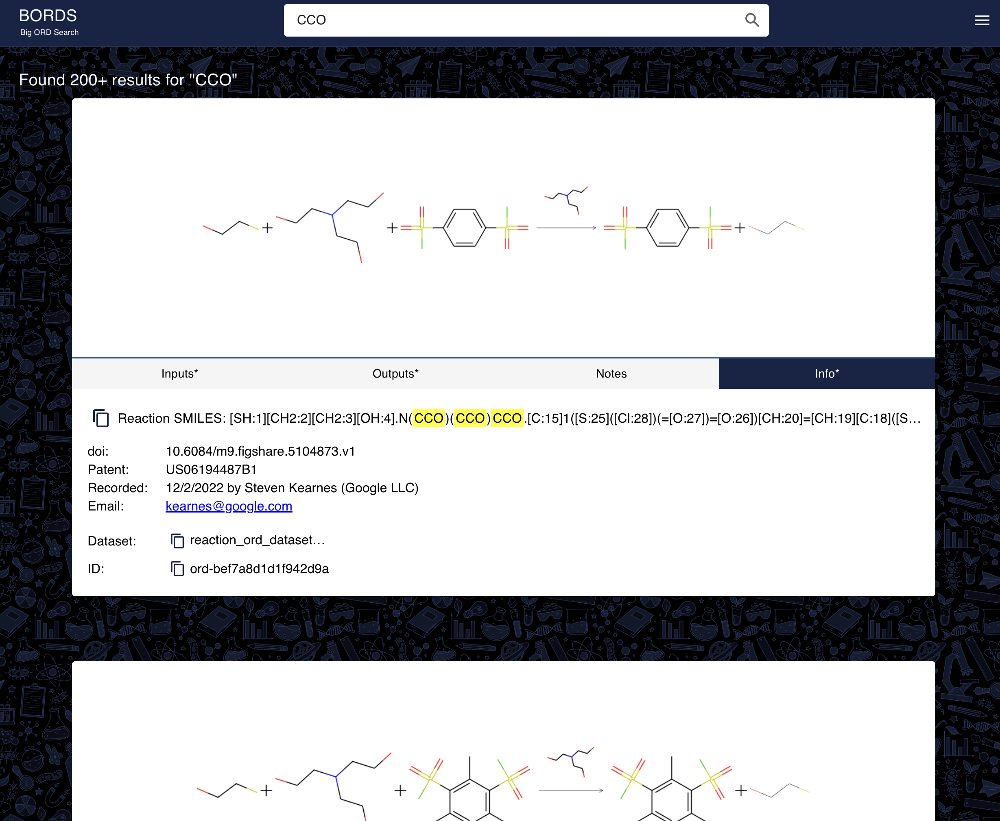
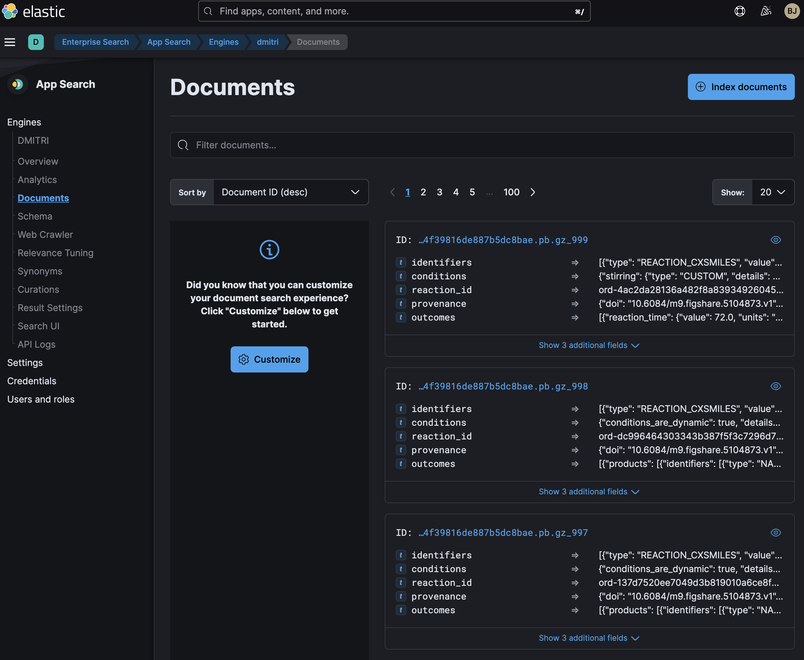
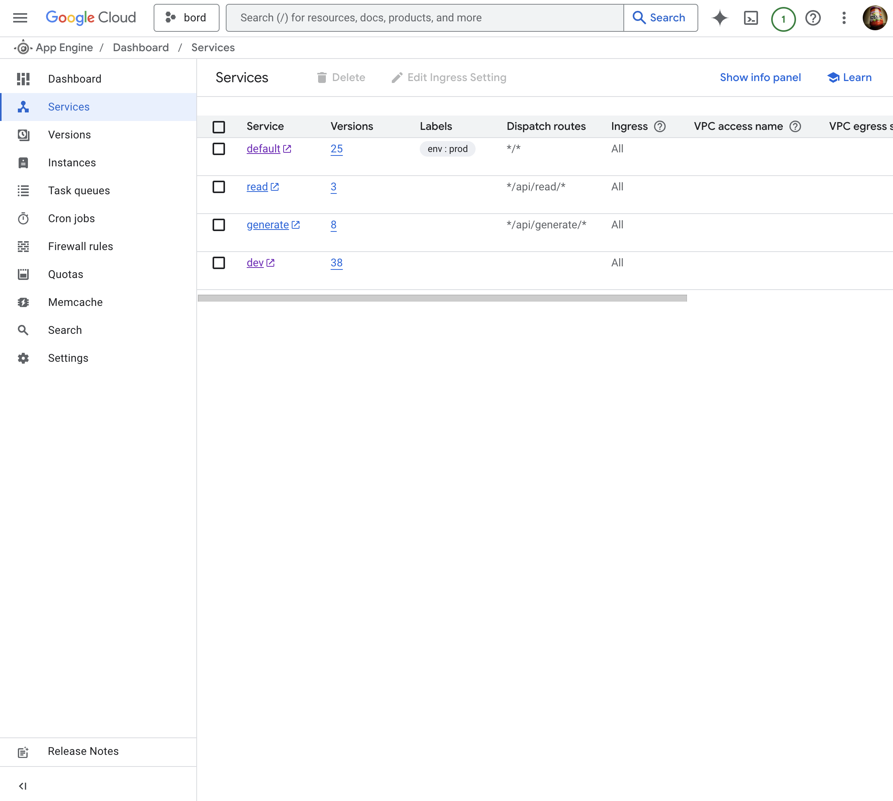
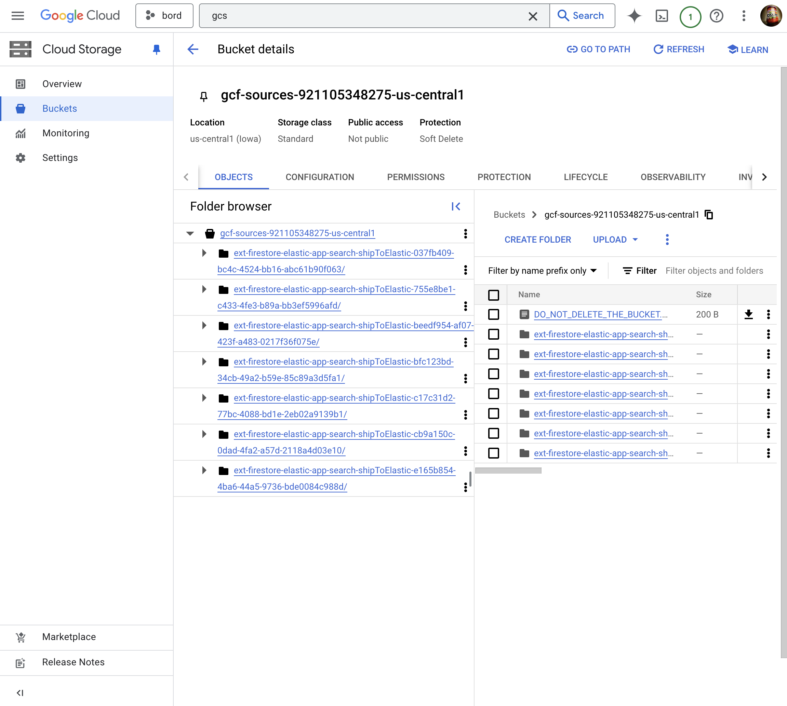
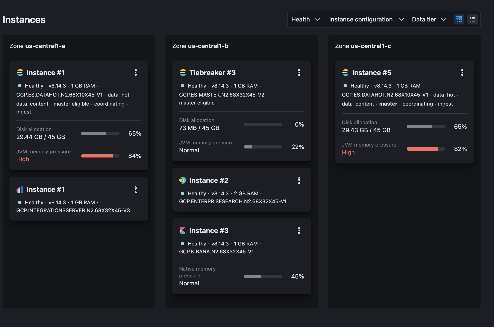
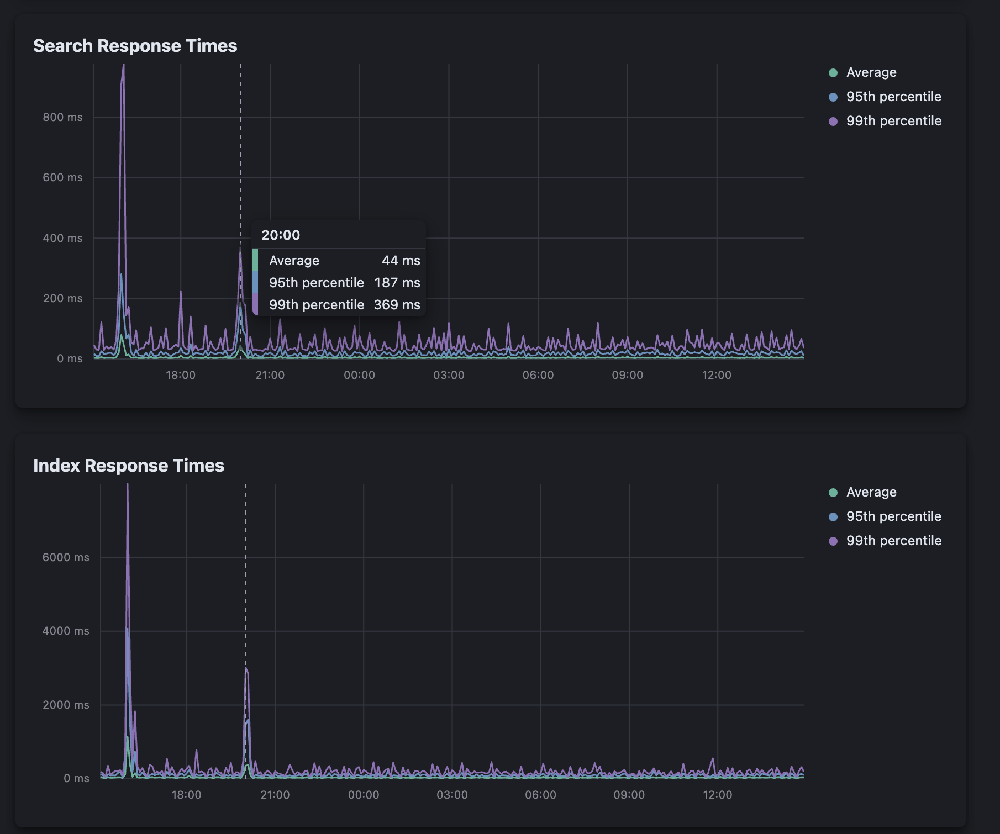

# **Big Open Reaction Database Search (BORDS)**
**Empowering chemical research with comprehensive, high-performance open-access reaction data.**

BORDS is an advanced **reaction search engine** built on **Google's Open Reaction Database (ORD)**. It provides **instantaneous access** to **millions of chemical reactions**, significantly improving search speeds compared to traditional platforms.  

📌 **Built with:** **Google Cloud Platform (GCP), Elastic Enterprise App Search, React, Python, and Firestore.**  
📌 **Optimized for:** **Sub-second query performance** (vs. 30+ seconds on other platforms).  
📌 **Designed for:** **Chemists, researchers, and data scientists** working on reaction prediction, synthesis planning, and retrosynthesis.  

---

## **📊 BORDS in Action**
### **Landing Page**

### **Search Results - Inputs**

### **Search Results - Outputs**

### **Search Results - Notes**

### **Search Results - Metadata**

---

## **🔍 What Makes BORDS Unique?**
✅ **Direct integration with Google ORD** – Live synchronization with ORD ensures **up-to-date** reaction data.  
✅ **High-speed search (seconds vs. 30+ sec)** – Built on **Elastic Enterprise App Search** for optimized query performance.  
✅ **Rich metadata support** – Displays reaction conditions, time-course data, and structural representations.  
✅ **Scalable cloud architecture** – Runs on **Google Cloud App Engine** with **autoscaling**.  
✅ **Molecule rendering & visualization** – Uses **RDKit and Flask** to generate reaction images dynamically.  

---

## **🛠️ Technology Stack**
### **🌍 Backend**
- **Google Cloud Platform (GCP)** – Fully managed, auto-scalable deployment.  
- **Google Cloud Firestore** – Stores processed reaction data for real-time retrieval.  
- **Python (Flask, RDKit)** – Handles reaction image generation.  
- **Node.js (Fastify, Elastic App Search)** – Enables ultra-fast reaction search queries.  
- **Elastic Enterprise App Search** – High-speed indexing and retrieval of reaction datasets.  

### **💻 Frontend**
- **React.js (Material-UI, Framer Motion)** – Provides a seamless and modern UI.  
- **Google Analytics (gtag.js)** – Tracks user behavior for performance optimization.  

---

## **📂 Document Overview (Indexed Reactions)**
BORDS indexes millions of **single-step reactions** into **Elastic Enterprise App Search**, providing instant access to structured reaction data.

Each indexed document includes:
- **Reaction Identifiers**
- **Conditions & Provenance**
- **Reaction Time & Outcome Data**
- **Links to External Chemical Databases**

---

## **⚙️ ETL Process - How Data is Processed**
BORDS employs a **high-performance ETL pipeline** to transform **Google ORD data** into a searchable format.

### **1️⃣ Extract**
- **Script:** `1_to_json.py`
- **Task:** Converts **Google ORD protocol buffer files** (`.pb.gz`) into structured **JSON** format.
- **Key Actions:**
  - Extracts **reactants, products, conditions, and metadata**.
  - Uses **multiprocessing** to handle large-scale datasets.

### **2️⃣ Transform**
- **Script:** `2_retry.py`
- **Task:** Prepares reaction data for indexing.
- **Key Actions:**
  - Stringifies nested fields (**identifiers, inputs, outcomes**).
  - Cleans and structures metadata for **efficient searching**.

### **3️⃣ Load (Firestore)**
- **Script:** `3_to_firebase.py`
- **Task:** Inserts reaction JSON data into **Google Cloud Firestore**.
- **Key Actions:**
  - Uses **batch inserts** for high-speed loading (~2000 docs/sec).
  - Implements **retry logic** for failed transactions.

### **4️⃣ Load (Elastic App Search)**
- **Script:** `4_to_es.py`
- **Task:** Indexes reactions into **Elastic Enterprise App Search** for fast querying.
- **Key Actions:**
  - Pulls from Firestore, transforms records, and **indexes in bulk**.
  - Implements **checkpointing** to resume failed syncs.

---

## **🚀 System Performance & Optimization**
### **Google Cloud Services Overview**
BORDS runs on **Google App Engine**, with **dedicated services for search, rendering, and indexing**.

### **Google Cloud Storage**
Used for **storing raw ORD datasets and reaction metadata**.

### **ElasticSearch Instance Performance**
Optimized **multi-region ElasticSearch cluster** with **high availability**.

### **Search & Index Response Times**
Achieves **44ms search time on average**.

---

## **📜 API Endpoints**
### **1️⃣ Reaction Search API**
- **Method:** `POST`
- **Endpoint:** `/api/read/search`
- **Description:** Performs a structured search on reaction datasets.

### **2️⃣ Molecule Rendering API**
- **Method:** `GET`
- **Endpoint:** `/api/generate/render_molecule?mol=<SMILES_STRING>&type=smiles`
- **Description:** Generates molecule images using RDKit.

---

## **📌 Roadmap**
✅ **Expand ORD integration** – Support for **multi-step reactions** & retrosynthesis.  
✅ **Enhance search filters** – SMILES-based substructure search.  
✅ **Develop API access** – Allow programmatic reaction retrieval.  

---

## **📜 License**
BORDS is open-source under the **CC-BY-SA license**.

---

## **📬 Contact & Support**
📧 **Email:** support@bordsearch.com  
🌍 **Live Demo:** [bordsearch.com](https://bordsearch.com)  

🚀 **Experience the fastest reaction search with BORDS today!**  